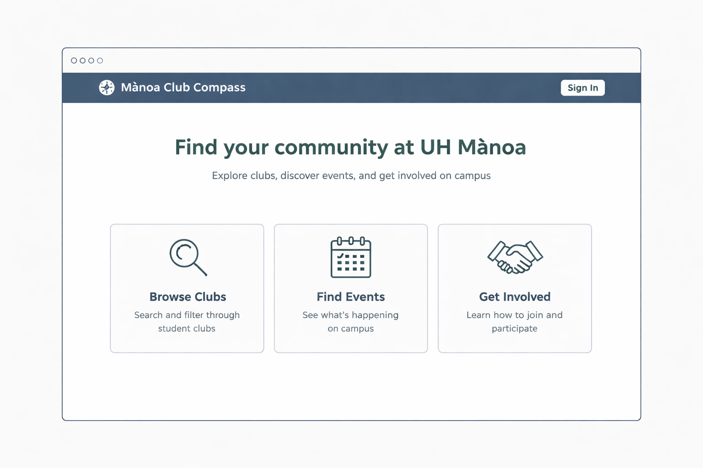
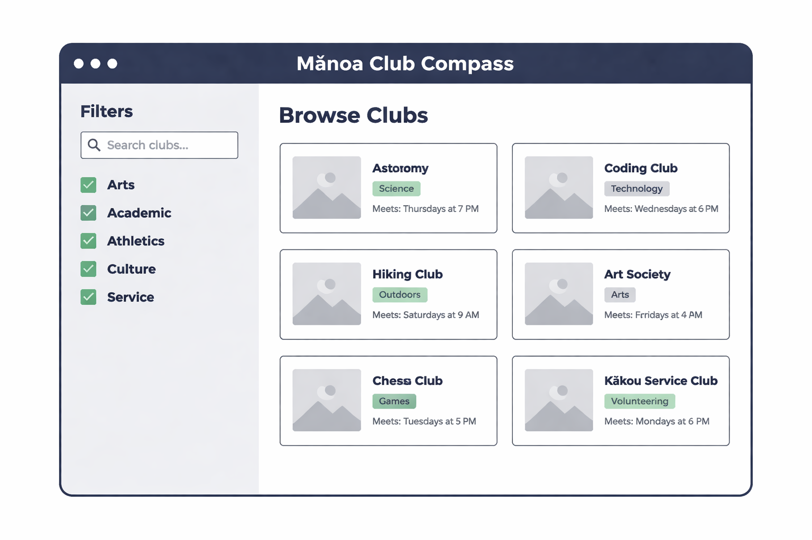
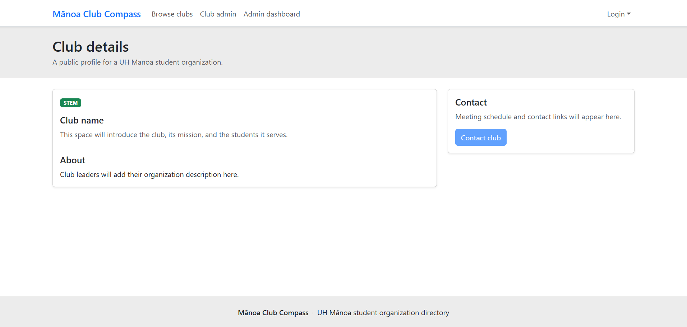
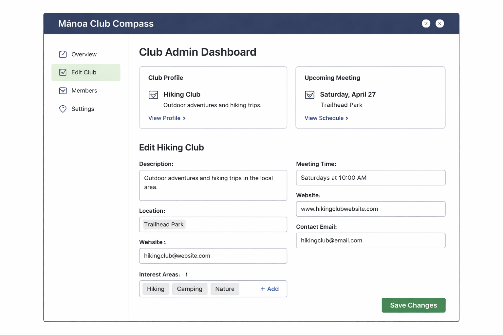
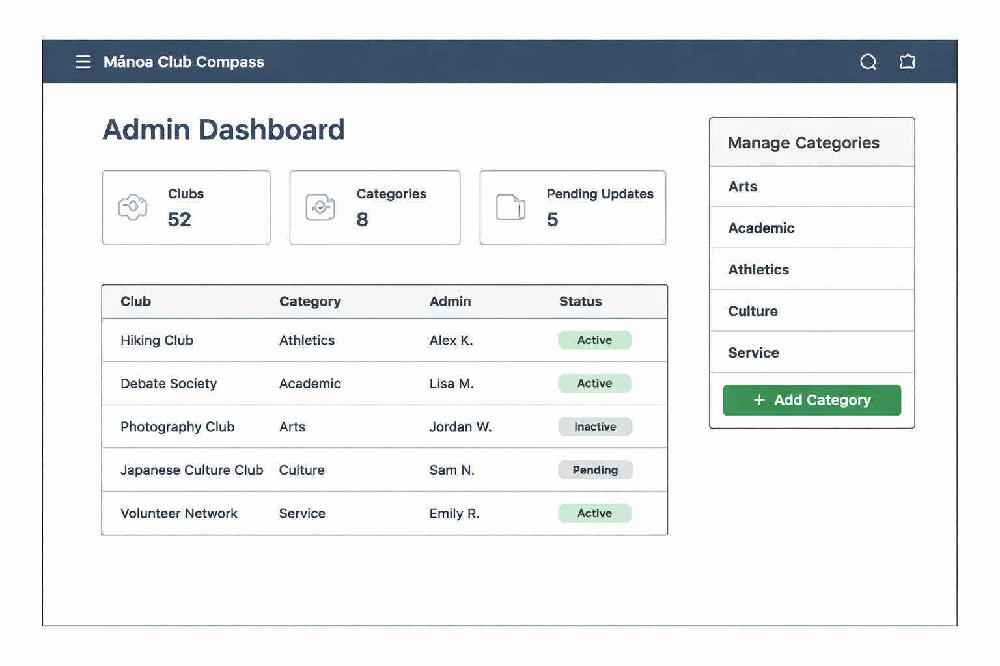

# Mānoa Club Compass

## Overview

Mānoa Club Compass is a centralized directory for UH Mānoa student organizations. It helps students discover clubs, browse by interest area, and find meeting and contact information.

## GitHub Organization
[View the manoa-club-compass GitHub organization and all it's relevant repositories](https://github.com/manoa-club-compass)

## Planned Features

- Browse and filter clubs by interest area.
- View club descriptions, meeting times, locations, contacts, and websites.
- Club administrators can update their club profile.
- Site administrators can manage clubs, categories, and club-admin access.

## Team Contract

[View our Team Contract](https://docs.google.com/document/d/1Awi8W8y4iuA7VAnEgqY_-I3zPHUNi6GED164ORaw-MU/edit?tab=t.0)

## Deployment
[View the deployed application on Vercel](https://manoa-club-compass-nextjs.vercel.app/)

## Milestones
 
### Milestone 1
[View the M1 Project page](https://github.com/orgs/manoa-club-compass/projects/2/views/1)
  
### Milestone 2
[View the M2 Project page (Placeholder)](google.com)
 
## Planned Mockups

### Landing Page

### Browse Clubs

### Club Details

### Club Admin Dashboard

### Admin Dashboard

