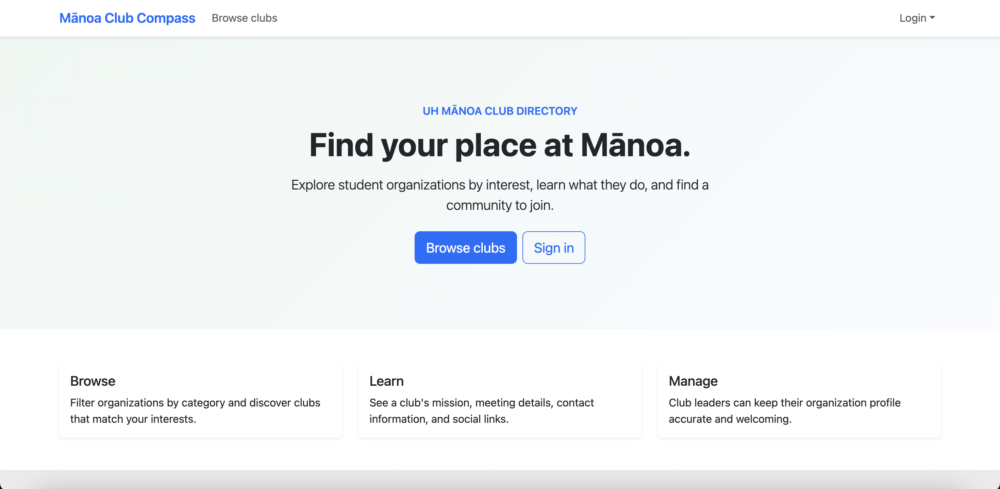
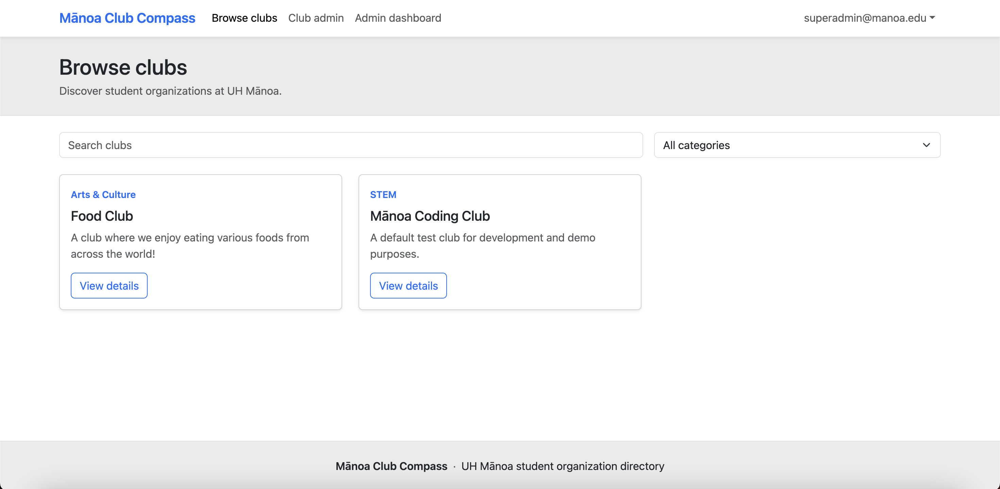
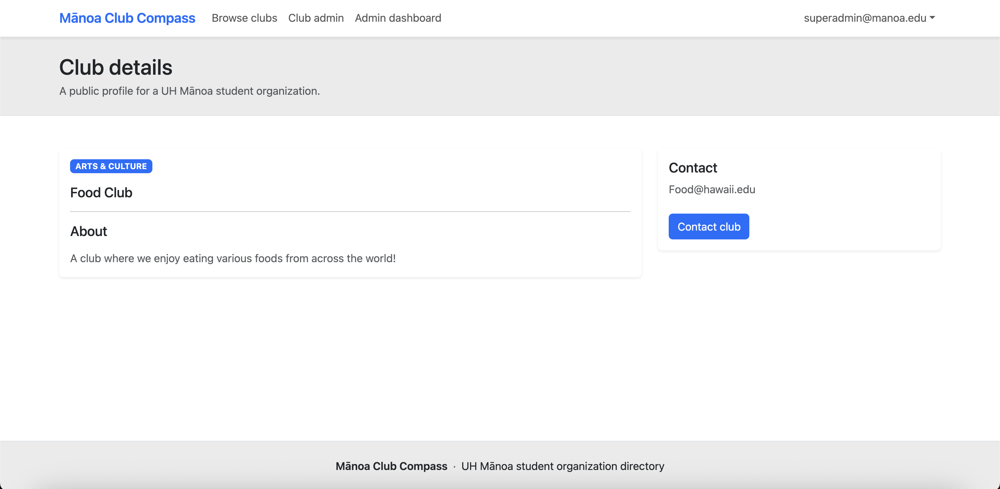
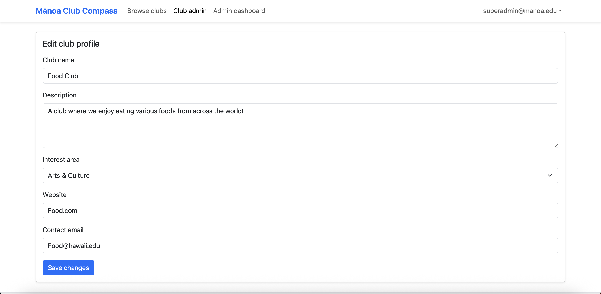
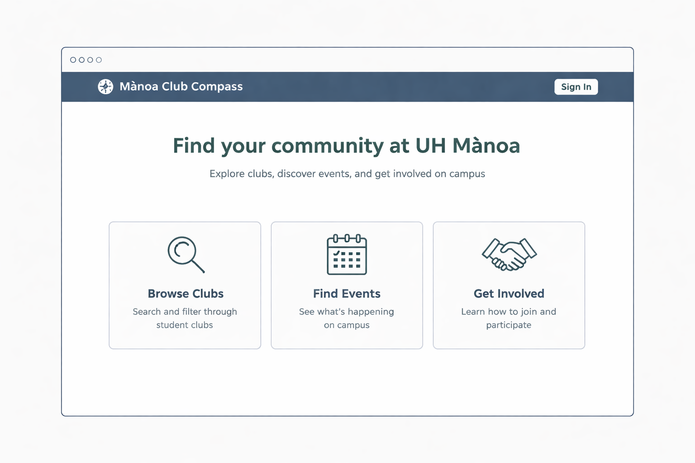
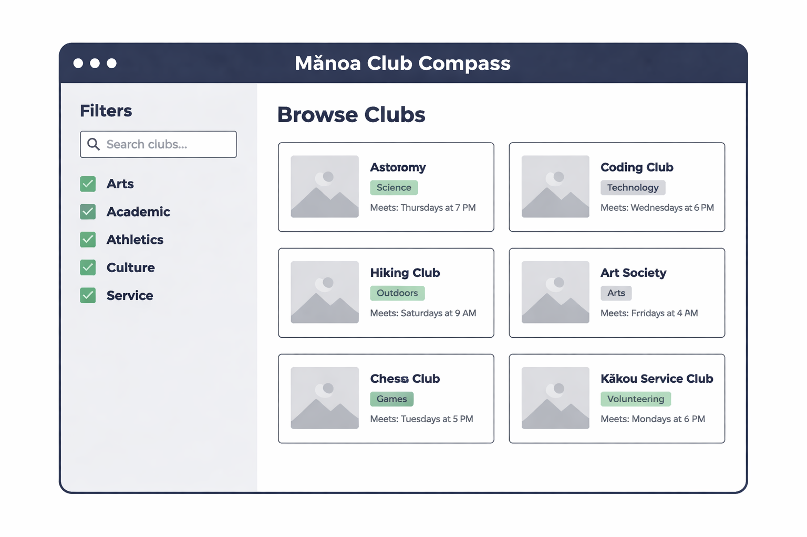
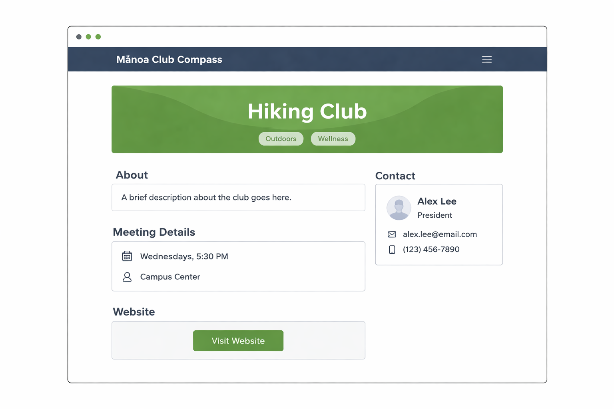
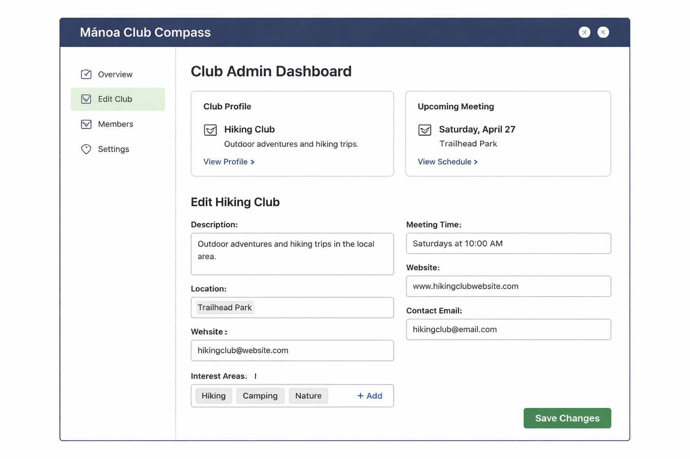
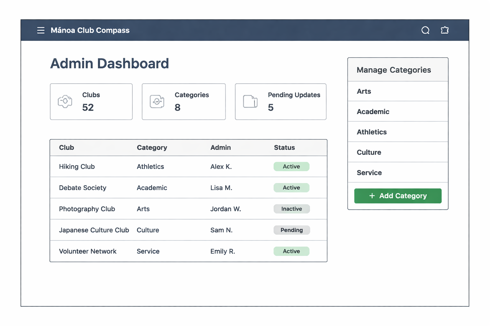
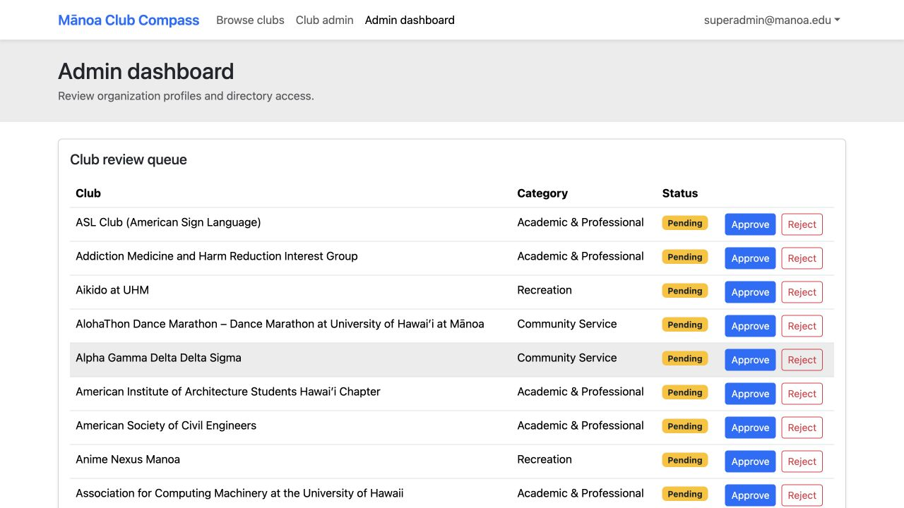

# Mānoa Club Compass

[](https://github.com/manoa-club-compass/manoa-club-compass-nextjs/actions/workflows/ci.yml)

## Overview

Mānoa Club Compass is a centralized directory for UH Mānoa student organizations. It helps students discover clubs, browse by interest area, and find meeting and contact information.

## GitHub Organization and Repositories

- [Mānoa Club Compass organization](https://github.com/manoa-club-compass)
- [Next.js application repository](https://github.com/manoa-club-compass/manoa-club-compass-nextjs)
- [Project home repository](https://github.com/manoa-club-compass/manoa-club-compass.github.io)

## Club Compass Scope

- Students can browse and filter clubs by interest area.
- Students can view club descriptions, meeting times, locations, contacts, and websites.
- Club administrators can update their club profile.
- Site administrators can manage clubs, categories, and club-admin access.

## Team Contract

[View our Team Contract](https://docs.google.com/document/d/1Awi8W8y4iuA7VAnEgqY_-I3zPHUNi6GED164ORaw-MU/edit?tab=t.0)

## Deployment

[Open Mānoa Club Compass on Vercel](https://manoa-club-compass-nextjs.vercel.app/)

## Milestones
 
### Milestone 1

[View the M1 Project page](https://github.com/orgs/manoa-club-compass/projects/2)
  
### Milestone 2

[View the M2 Project page](https://github.com/orgs/manoa-club-compass/projects/3)

## User Guide

### Landing Page



Upon loading in the app, the user is directed to the landing page where they can select to log in or sign in, or click the browse clubs button to browse instead.

### Browse Clubs



The browse clubs page include a variety number of clubs made by various club admins. Users can sort by categories or search by name. Click on view details to view more in depth information about each club. 

### Club Details



Users can view in depth detail about specific clubs, including information about the club, and how to contact each club via email. 

### Club Admin Dashboard



Users logged in can have access to their own Club Admin Dashboard tab, where they can create and adjust their clubs name, descriptions, cateogries, website link, and contact email for public viewing. 

## Developer Guide
 
1. **Install PostgreSQL** and create a database:
```
createdb manoa-club-compass
```
 
2. Clone the repo on Github.
  
3. Install dependencies:
```
npm install
```
 
4. Create your `.env` file — copy `sample.env` to `.env` and update `DATABASE_URL`.
  
5. Run migrations:
```
npx prisma migrate dev
```
 
6. Generate the Prisma client:
```
npx prisma generate
```
 
7. Seed the database:
```
npm run seed
```
 
8. Start the dev server:
```
npm run dev
```
 
The app should run at http://localhost:3000.

 
## M1 Page  Mockups

The following show the M1 required supporting-page mockups.

### Landing Page Mockup



### Browse Clubs Mockup



### Club Details Mockup



### Club Admin Dashboard Mockup




### Admin Dashboard Mockup



### Admin Dashboard



*Not yet implemented
